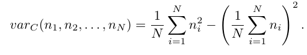

# Laboratorio 3: cicli (precondizionale, for), array e funzioni

Gli esercizi vanno eseguiti nell'ordine proposto, questa volta. Attenzione alla differenza tra la _varianza del campione_ definita nell'__Esercizio 2__ e la varianza (deviazione standard) definita a lezione e usata negli esercizi __4__ e __5__.

## Ricordate
- compilare: __g++ `<nomefilesorgente> ` -o `<nomefileeseguibile> `__
- eseguire:` ./<nomefileeseguibile> `

Niente spazi tra . e / e tra / e nomefile
- convenzionalmente il file sorgente si indica con estensione .C oppure .cpp oppure .cxx. Questo consente, tra l'altro, anche a gedit di inferire la tipologia di contenuto del file e evidenziare la sintassi.

## Esercizio 1
Scrivere un programma che chieda all'utente di inserire un numero intero positivo fino a che l'utente non inserisce effettivamente un numero positivo. Obbligatorio l'uso di un ciclo post-condizionale.

## Esercizio 2
Scrivere un programma che legga in ingresso una sequenza di numeri interi positivi terminata dall'inserimento, da parte dell'utente, dello zero. Il programma, oltre a calcolare la somma e la media aritmetica dei valori inseriti (vedi esercizio 4 settimana 2), dovrà anche calcolare la _varianza del campione_ definita come:
 

## Esercizio 3
Estendere le funzionalità del programma scritto per l'__Esercizio 2__ alla determinazione dei valori validi (>0) più grandi e più piccoli inseriti. Stampare a video anche gli elementi minimo e massimo individuati.

## Esercizio 4
Modificare le funzioni contenute nel file __stat01.C__ sostituendo ai cicli __while__ precondizionali presenti gli equivalenti cicli __for__.

## Esercizio 5
Dichiarato un vettore di 5 interi, modificare l'esercizio 4 in modo tale che:

1. L'utente inserisce 5 dati validi (questa volta >= 18). I dati validi vengano ciascuno memorizzato in una componente del vettore: il primo dato valido nella prima componente del vettore, il secondo dato valido nella seconda, e così via....
2.  Terminato l'inserimento dei dati il programma dovrà calcolare media e deviazione standard dei dati inseriti, insieme a minimo e massimo.
3. Per il calcolo della media e della deviazione standard, usate le funzioni contenute nel file __stat01.C__ (modificato nell'esercizio precedente. Copiate e incollate!)
4. Definite invece due funzioni __myMax__ e __myMin__ che, presi in ingresso un array di interi e la sua dimensione, restituiscano, rispettivamente, il valore massimo e minimo contenuti nel vettore.

__NOTA__: al punto __5.1__ cominciate assumendo che l'utente inserisca solo dati validi. Aggiungere poi un controllo nel luogo opportuno.
__SUGGERIMENTO__: per il controllo, usate il codice prodotto nell'__Esercizio 1__ dentro al __for__.
__ATTENZIONE__ Le funzioni in __stat01.C__ sono definite per vettori di __float__. Modificatele per lavorare su vettori di __int__. E occhio alle divisioni!!!!
